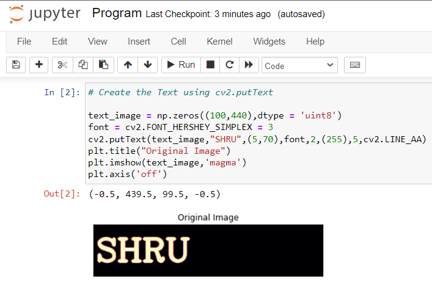
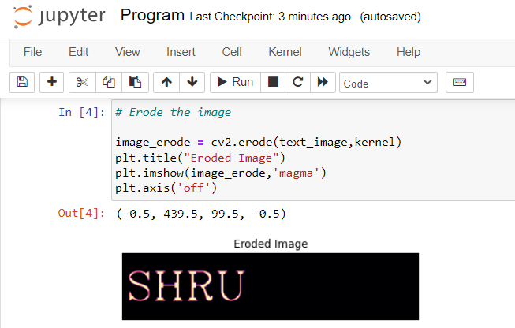
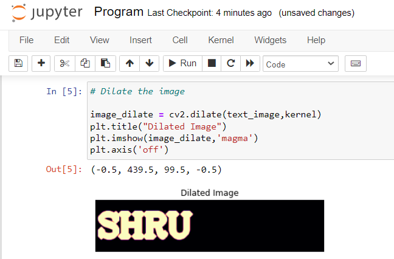

# IMPLEMENTATION OF EROSION AND DILATION
## AIM:
To implement Erosion and Dilation using Python and OpenCV.
## SOFTWARE REQUIRED:
Anaconda - Python 3.7

OpenCV
## ALGORITHM:
### Step 1:
Import the necessary packages.
### Step 2:
Create the text image using cv2.putText.
### Step 3:
Then create the structuring image for dilation/erosion.
### Step 4:
Apply erosion and dilation using cv2.erode and cv2.dilate.
### Step 5:
Plot the images using plt.imshow. 
## PROGRAM:

Developed by : Shrruthilaya G

Register number : 212221230097
### Import the necessary packages
```python
import cv2
import numpy as np
import matplotlib.pyplot as plt
```
### Create the Text using cv2.putText
```python
text_image = np.zeros((100,440),dtype = 'uint8')
font = cv2.FONT_HERSHEY_SIMPLEX = 3
cv2.putText(text_image,"SHRU",(5,70),font,2,(255),5,cv2.LINE_AA)
plt.title("Original Image")
plt.imshow(text_image,'magma')
plt.axis('off')
```
### Create the structuring element
```python
kernel = cv2.getStructuringElement(cv2.MORPH_CROSS,(7,7))
```
### Erode the image
```python
image_erode = cv2.erode(text_image,kernel)
plt.title("Eroded Image")
plt.imshow(image_erode,'magma')
plt.axis('off')
```
### Dilate the image
```python
image_dilate = cv2.dilate(text_image,kernel)
plt.title("Dilated Image")
plt.imshow(image_dilate,'magma')
plt.axis('off')
```
## OUTPUT:

### Input Image

<br>
</br>


### Eroded Image

<br>
</br>

### Dilated Image

<br>
</br>


## RESULT:
Thus, the generated text image is eroded and dilated using python and OpenCV.